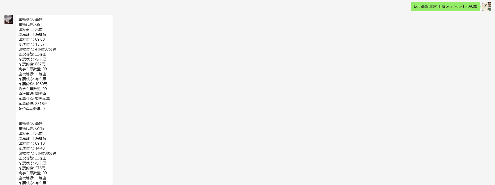
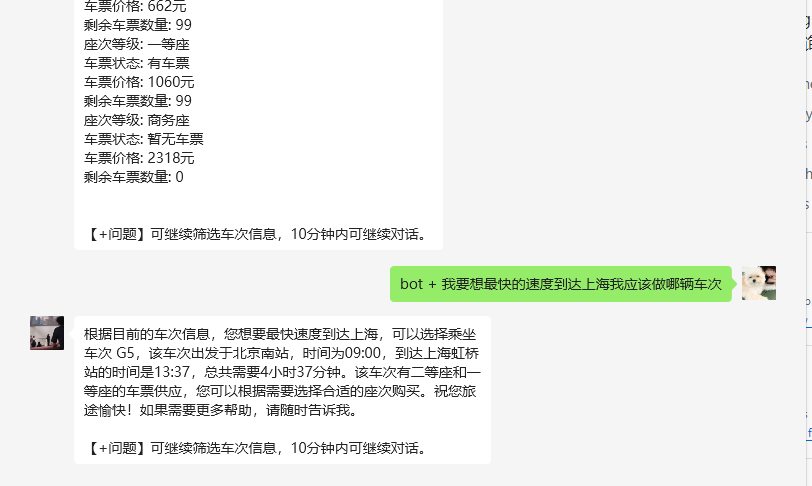

# HighSpeedTicket
基于chatgpt-on-wechat创建的高铁（火车）票查询插件,可查询直达跟中转两种方式,查询后可发送`+`问题进行进一步的筛选

## 直达用法
发送【票种 出发地 终点地 查询日期 查询时间】获取票务信息,会获取5个离查询时间最近的车次

例如：`【高铁 北京 上海 2024-06-05 09:00】`

发送`+`问题进行进一步的筛选

## 中转用法
查询中转方案时比如驻马店到金华,中间要在武昌中转,要先发送`高铁 驻马店 武昌 2024-06-06 09:00`,在发送`中转+ 高铁 武昌 金华 2024-06-06 00:00`

然后在进行追问发送`+`加上你的问题即可.

**注：这里使用gpt-4o效果会更好一些**

## 联系方式

有什么问题可以在群里面进行提问

## 贡献
如果您有任何改进意见或功能请求,请随时提交 Pull Request 或创建 Issue.
